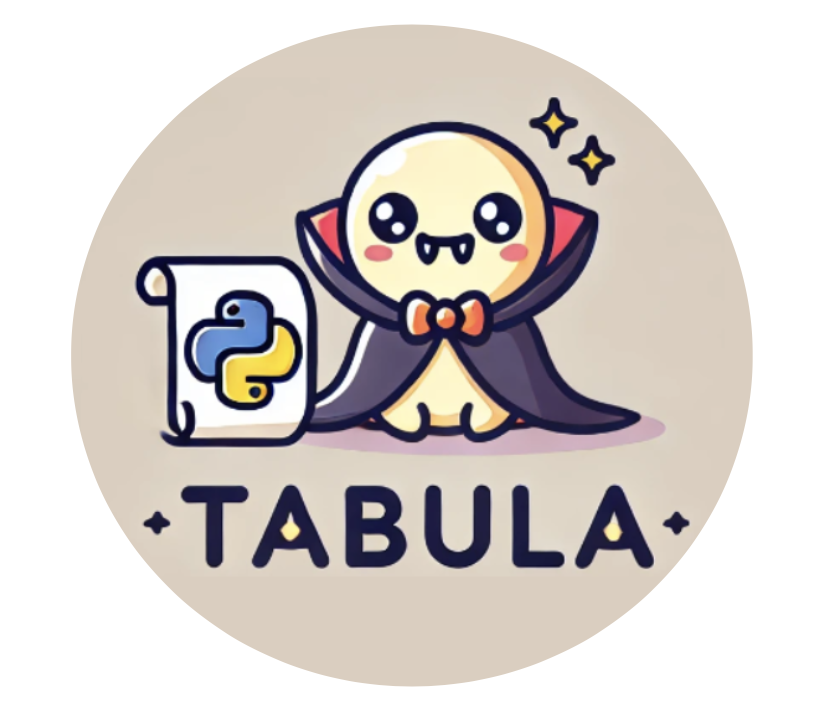
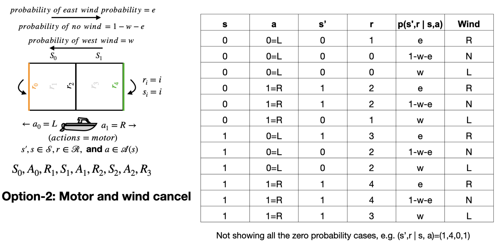
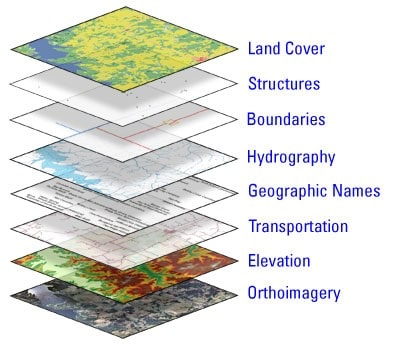
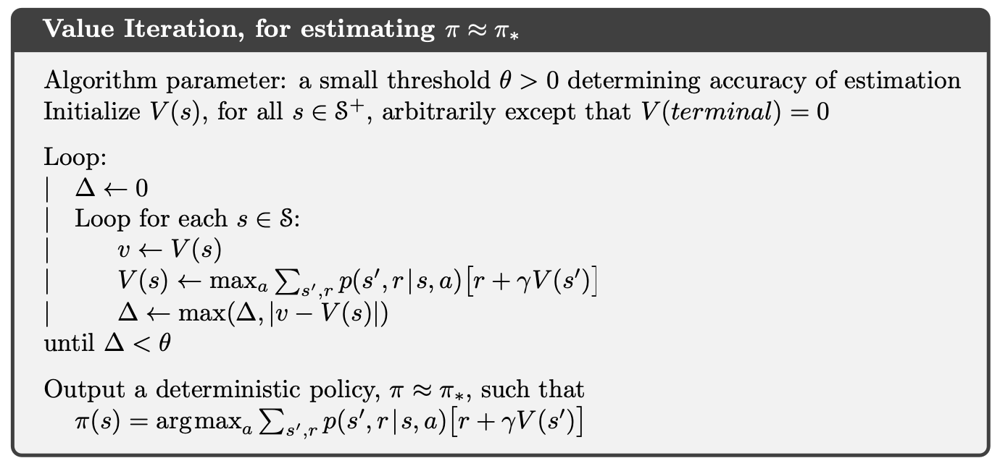
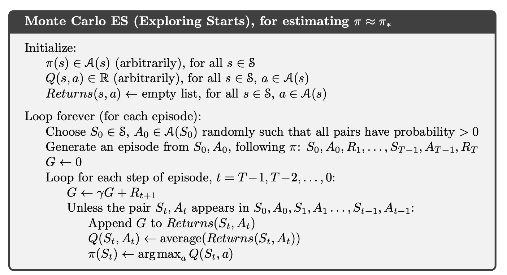
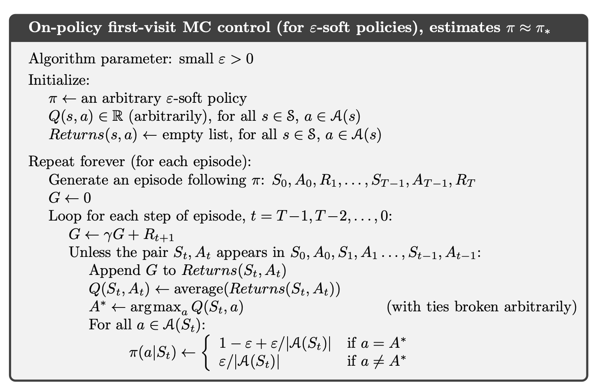
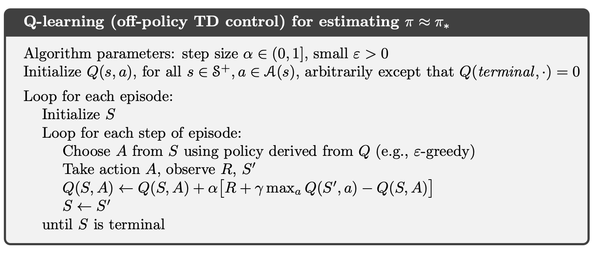

# Homework-2: Tabular RL

## Submission

The submission will be a combination of a Jupyter notebook, `HW-2.ipynb`, with a rendered output `HW-2.html` which will act as a condensed show-case for summarization of your results, and a compressed folder with a python package called `Tabula`, which you will write from scratch.

{width=300}

**NOTE**: `Do not wait until the last minute` to start on this assignment, it is a large one and takes a long time to complete. It is recommended that you set aside 15 to 25 hours over the next several weeks to complete it.

## Tabula

Please use object-oriented programming, i.e. create classes.

You can organize the package however you like, for example, in a `simulation` module and a `solver` module.

It is recommended that you prototype in `.py`, once the packaged is finalized you can run a notebook one last time at the end for summarization of the results. 

* Feel free to use Co-Pilot or Cursor for development acceleration, but don't rely on it so much that you lose sight of the big picture, or logical flow of your code, i.e. develop slowly, via incremental improvement
  * For example, create a code block to implement some functionality, make sure your understand it completely
  * Run `unit-tests` to make sure the code is working 100% correctly
    * **Note**: A `unit test` verifies the correctness of a small, specific section of code, such as a function or method, by testing its output against expected results, ensuring functionality in isolation.
  * Debug and improve until the code is working robustly and as intended 
  * Move onto the next code challenge and repeat the process

Have a `verbose` flag that when `True` reports all relevant quantities in a clean and professional manner and generates a set of relevant plots, e.g. arrow plot for the optimal policy, convergence plots for the value function, etc.

The package should implement the following functionality 

### Simulator 

Simulate the "games" outlined below  

* All environment simulations should be wrapped in the standard `gym` formalism
* Your code should work for the following games  
  * `Boat`
  * `Grid-world` 
  * `Geosearch` 
* **Optional**: Visualize game-play progress, e.g. via a `GIF` progress

**Game details**

Implement the following

`Boat`

For consistency across students, please use simulation-parameters $e=0.7$ and $w=0.3$

`Gridworld`

Specific version of grid-world

Where the environmental noise comes from the robot malfunctioning and only doing the specified action with probability $1-\gamma$, use $\gamma=0.25$

`Geosearch`:  

This is another grid-world but slightly more complicated, use a 25x25 grid

* Assume there is a set of "resource distribution functions" 

For example:

$f_1(x,y)$ = water distribution (probability distribution for water)

$f_2(x,y)$ = gold distribution (probability distribution for gold)

These simulate layers of geographic quantities of interest withing the grid-world, the following cartoon visualizes this idea.

For simplicity assume these are just 2D Gaussian distributions as follows

$$f(x, y)=\frac{1}{2 \pi \sigma_X \sigma_Y \sqrt{1-\rho^2}} \mathrm{e}^{-\frac{1}{2\left(1-\rho^2\right)}\left[\left(\frac{x-\mu_X}{\sigma_X}\right)^2-2 \rho\left(\frac{x-\mu_X}{\sigma_X}\right)\left(\frac{y-\mu_Y}{\sigma_Y}\right)+\left(\frac{y-\mu_Y}{\sigma_Y}\right)^2\right]}$$ 

For the parameters $\boldsymbol{\mu}$ and $\mathbf{\Sigma}$

$$\boldsymbol{\mu}=\binom{\mu_X}{\mu_Y}, \quad \mathbf{\Sigma}=\left(\begin{array}{cc}
\sigma_X^2 & \rho \sigma_X \sigma_Y \\
\rho \sigma_X \sigma_Y & \sigma_Y^2
\end{array}\right)$$

For the simulation parameters use

$f_1 \rightarrow \boldsymbol{\mu}=(20,20), \sigma_X=1, \sigma_Y=1, \rho=0.25$

$f_2 \rightarrow \boldsymbol{\mu}=(10,10), \sigma_X=1, \sigma_Y=1, \rho=-0.25$

From these, you can create a matrix (heat-map), with the value of these functions sampled at the lower left corner of the grid. For example cell (0,0) $\rightarrow$ x=0,y=0

The state-reward is created based on a weighted sum of these

$R(x,y)= A f_1(x,y) + (1-A) f_2(x,y)$ 

Where $A$ is a user-parameter that defines the explorers primary interests, for example (A)=1 would mean they only care about water and not gold. For consistancy, Please use `A=0.75`

## Solver 

Unless otherwise stated, for each method below, start with a initial random policy where each transition is equally likely, e.g. [0.5,0.5] for the boat example, or a [0.25,0.25,0.25,0.25] for the grid-worlds. To balance the exploration-exploitation trade-off, use epsilon-greedy policy with $\epsilon=0.1$.

Given a particular game, with associated set of hyper-parameters, solves the MDP via the following methods

### Dynamic Programming

* Run a long simulation to get a very good approximation of the following:
    * $p\left(s^{\prime}, r \mid s, a\right)$
    * Report this as a table
    * Note: The transition model $p\left(s^{\prime}, r \mid s, a\right)$ does not depend on the policy. It describes the dynamics of the environment, specifying the probability of transitioning to a new state $s^{\prime}$ and receiving a reward $r$ given that the agent is currently in state $s$ and takes action $a$.
  * Therefore you can approximate it with any policy, e.g. a random policy
* **Note**: This will yield an **approximation** of the transition model, so it is not "true" dynamic programming, but it is sufficient for our purposes. You can use `np.round(p,3)` to round the transition model to 3 decimal places.

You can implement, policy iteration, or value iteration, or both, it is up to you.

You can deviate from Sutton's implementation details, but below are the pseudo-codes for the methods for reference.

* Ensure there is robust documentation and reporting methods.

### Monte-Carlo

Implement the following, again You can deviate from Sutton's implementation details, but below are the pseudo-codes for the methods for reference.

### Temporal Difference

Implement the following, again You can deviate from Sutton's implementation details, but below are the pseudo-codes for the methods for reference.

You can use the SARSA Q-values with an epsilon-greedy policy.

## Notebook: Report

In the file `HW-2.ipynb`, showcase the results of your package.

Create a sub-section for each game, and within each game, create sub-sub-sections for each method.

Run the simulation with the specified hyperparameters and report your results.

For each game and each method, report the following at a minimum:

- Approximation of the transition model (if available)
- For the optimal policy:
  - The state-value function
  - The action-value function
  - An arrow plot showing what the agent will do in each state under the optimal policy
  - Convergence plots of the state-value function, action-value function, and policy

Important: Add markdown cells throughout to explain your results, and include additional markdown cells at the end to summarize your findings.

If `game == Boat`, you should also output the analytical solution for the state values. You can start with the final solution; the derivation of the analytical solution is not required, as it is provided in the lecture notes and was part of your exam.

## Optional Aside 

For the `Geo-search`, the equation for the reward function can be generalized to include more than two variables.
For example, if you have $N$ different resource distributions, the reward function can be expressed as a weighted sum of these distributions. The general form would be:

$$
R(x, y)=A_1 f_1(x, y)+A_2 f_2(x, y)+\cdots+A_N f_N(x, y)
$$

Where:
- $f_1(x, y), f_2(x, y), \ldots, f_N(x, y)$ are the different resource distribution functions.
- $A_1, A_2, \ldots, A_N$ are the weights corresponding to the explorer's preference for each resource. These weights should satisfy the condition:

$$
A_1+A_2+\cdots+A_N=1
$$

This ensures the weights are properly normalized and the reward is distributed proportionally based on the explorer's interests.

Example for 3 resources:
If you have three resources (e.g., water, gold, and silver), the reward function would look like this:

$$
R(x, y)=A_1 f_1(x, y)+A_2 f_2(x, y)+A_3 f_3(x, y)
$$

Where $A_1+A_2+A_3=1$. For example, if the explorer's preferences are $A_1=0.5, A_2=0.3$, and $A_3=0.2$, the reward function will reflect that water (resource 1 ) is weighted more heavily than gold or silver.